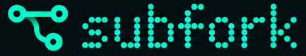

  

# Subfork Examples

Importable example graphs for [Subfork](https://subfork.com), an open graph
platform owned and operated by Enluminari LLC.

Start with [Hello, World](graphs/html/hello-world.notes.md). It is a four-node,
credential-free graph that turns plain text into a static HTML page.

## Use An Example

1. Download a `*.subfork.json` file from this repository.
2. Open a graph in Subfork.
3. Open Graph Settings and select **Import**.
4. Choose the downloaded file. Import replaces the graph currently open, so use
   a new graph unless you intend to replace it.
5. Review the companion `*.notes.md` file for inputs, credentials, network
   access, and expected outputs, then run the graph.

See [Importing examples](docs/importing.md) for more detail and
[provider requirements](docs/providers.md) before running graphs that access
external services.

## Categories

- [`graphs/html/`](graphs/html/) contains static pages, SVG visualizations, and response examples.
- [`graphs/geo/`](graphs/geo/) contains public geographic-data maps and situational views.
- [`graphs/dashboards/`](graphs/dashboards/) contains linked, interactive panel layouts.
- [`graphs/3d/`](graphs/3d/) contains graph-authored scenes and 3D data visualizations.
- [`graphs/ai/`](graphs/ai/) contains provider-backed media workflows and design probes.
- [`graphs/calendar/`](graphs/calendar/) contains event normalization, merging, and briefing examples.
- [`graphs/pipes/`](graphs/pipes/) contains feed, text, row, and digest transformations.
- [`graphs/games/`](graphs/games/) contains graph-authored playable browser experiences.

Featured examples include [Planet Pulse](graphs/geo/planet-pulse.notes.md),
[Regional Watch](graphs/dashboards/regional-watch.notes.md),
[Seismic Globe](graphs/3d/seismic-globe.notes.md),
[Signal Garden](graphs/html/signal-garden.notes.md), and
[Signal Runner](graphs/games/signal-runner.notes.md).

## File Convention

Runnable examples have two files:

- `<name>.subfork.json` is the importable graph document.
- `<name>.notes.md` explains behavior, requirements, limitations, and expected outputs.

A notes-only entry is a design proposal rather than an importable graph. See
[Authoring examples](docs/authoring.md) and [CONTRIBUTING.md](CONTRIBUTING.md)
before proposing changes.

## License

Copyright 2026 Enluminari LLC.

The example graphs, documentation, and supporting code in this repository are
licensed under the [Apache License 2.0](LICENSE).

The Subfork name and logos are trademarks of Enluminari LLC and are not licensed
under the Apache License 2.0. The logo in `assets/` may be used only as described
in [TRADEMARKS.md](TRADEMARKS.md).

Third-party services, models, APIs, datasets, media, and trademarks referenced by
an example remain subject to their respective terms and licenses.
